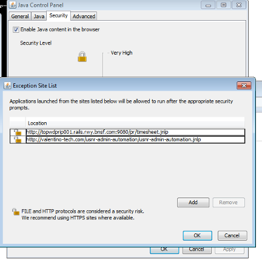
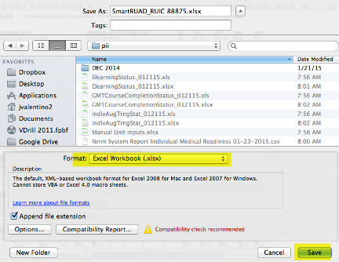
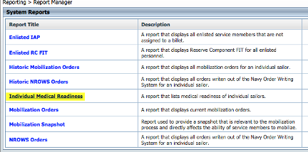
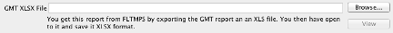
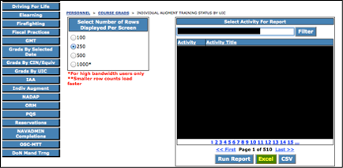

# USNR Admin Automation Project

This is a Java Desktop application that I wrote, which was used as a kitchen-sink style solution to the United States Navy Unit Management problem. The problem was that in the Navy there is no one system for any piece of information, medical is on this website, training is on this other website, and your orders are over here. The end result was that when trying to manage a unit of 40+ people, trying to assemble a complete picture of readiness was hours of work, error prone, and at the end of the day was really just merging a bunch of spreadsheets together.

The other problem with this approach was that it was not focused on the indiviudal members. Units would typically just post a packet of paper telling everyone who was deliquent, which was hard to understand and act on. While a lot of this information could be obtained by the member themselves, the act of just connecting to a CAC-protected website using a personal computer requires a masters in computer science, thus is out of the reach of the average sailor.

The primary function of this application was to be fed a bunch of the different outputs of these various websites, which are usually spreadsheets, and combine them into:

1. A summary report that combines everything into a single view for leadership
2. A report personallized for each unit member, telling them everything they need to do

We would then hand these reports out at the beginning of the drill weekend, and promptly encourage sailors to go fix themselves with this information. It is also something that they could take home, so that they would have for example the specific list of training they need to have done by the end of the month.

## Why this Architecture?

Good question. The US Government and specifically the US Navy gets very touchy when it comes to storing PII anywhere. As such, trying to build a web-based system was out of the question, which is why the focus was on the desktop, because under specific conditions we can have PII there. Additionally, the Java runtime environment was used because it was available on every NMCI machine, so we coudl run it on any Navy base.

## What is the state of this project?

Inactive. I originally wrote this in Groovy 2, on Java 8, using Gradle 3, and the world has moved on to much later versions of those technologies. I made an attempt to upgrade to Groovy 3, Java 19, and Gradle 7.6, however there are three specific unit tests that are failing because of garbage characters being picked up via the spreadsheets. It can probably be fixed by upgrading POI, but still this has to be gone through function by function to get it working again.

You can actually run it using `gradle run`, however with the 3 failing unit tests I woudl question its accuracy.

The Mac application bundler is also completely busted, as it doesn't work in the modern version of Gradle.

As such this is here for histroical purposes, and incase someone wants to pick this back up and run with it.

## Summary

When you open the app, this is what you see:

Each section on the left was at one time a standalone application that I just rolled into this.

#### CAC Utility

Since it was very common for someone's CAC to all the sudden stop working, and to have never worked when first issues, I came up with a way to debug card content:

This means there is Java code for dealing with all of that dual authentication security mechanisms that probably can't be found anywhere else on the internet but here.

#### SharePoint Downloader

The Navy Reserves though it woudl be a great idea to have all units consistenly manage their business via SharePoint on NMCI. This worked great, until it didn't and all of SharePoint would go down. This became so much of a problem on Drill Weekends specifically, that I resorted to writing this application to iterate over an entire navy.mil CAC-protected SharePoint site, and download it. That way when we would find ourselves without SharePoint, we would just look the missing document on CD.

#### Report Merger

The bulk of the documentation is about this particular funciton, as just getting the data to feed it is a science fair project unto itself.

 The purpose of this tool is to combine member data from the following       locations:    

- ​        **NRRM Smart Ruad**: Get an XLS file from exporting the NRRM         SmartRaud, open it in Excel, and save it in XSLX format.      
- ​        **NRRM IMR**: Get the CSV file from exporting the Indivudal Medical         Readiness for your unit on NRRM.      
- ​        **FLTMPS GMT Report**: Get the XLS file from export GMT status on         FLTMPS, open it in Excel, and save it in XSLX format      
- ​        **FLTMPS e-Learning Report**: Get the XLS file from export         e-Learning status on FLTMPS, open it in Excel, and save it in XSLX         format      
- ​        **FLTMPS Individual Augmentee Report**: Get the XLS file from         export IA status on FLTMPS, open it in Excel, and save it in XSLX         format      
- ​        **Manual Inputs**: An XLSX file containing manual unit inputs, kept         in the PII section of SharePoint      

​      Combining all of these reports will result in two things:: 

1. ​        **Generated Individual Member Action Plan.pdf**: A member-per-page         printout that specifies all actions that a member needs to take in         terms of e-Learning courses, GMT courses, medical status, AT plans,         clearance, and more.      
2. ​        **Generated Unit Tracker.xls**: A single spreadsheet that uses one         member per row to list all information in a single place.      

# Windows Installer

Download the JAR file from **NO LONGER AVAILABLE**

Double-click on it to run it. 

Follow the installation prompts making sure to install the application at a location to which you have write access, like your desktop.

# Mac App

Download the ZIP file from **NO LONGER AVAILABLE**

Double-click on the zip file to extract it.

Drag the .App file to your Applications folder.

# Running the application using Java Web Start

## For some versions of Java, add an Exception

On Windows you can access the Java Control Panel through the Windows Control Panel. On a Mac you can find it in System Preferences. You may have to add the URL of the JNLP file to the Exception list to be able to download it.

## Open the link in a web browser

**LINK NO LONGER AVAILABLE**

## Open the file with Java Web Start

## Select to run the application

You have to check the box that you “Accept the risk and want to run the application,” and press the “Run” button.

This I didn’t want to spend a couple hundred bucks to pay for a production certificate.

## Wait for the application to download and launch

# Report Merger

The purpose of this tool is to combine member data from the following locations:

- **NRRM Smart Ruad**: Get an XLS file from exporting the NRRM SmartRaud, open it in Excel, and save it in XSLX format.
-  **NRRM IMR**: Get the CSV file from exporting the Indivudal Medical Readiness for your unit on NRRM.
- **FLTMPS GMT Report**: Get the XLS file from export GMT status on FLTMPS, open it in Excel, and save it in XSLX format
- **FLTMPS e-Learning Report**: Get the XLS file from export e-Learning status on FLTMPS, open it in Excel, and save it in XSLX format
- **FLTMPS Individual Augmentee Report**: Get the XLS file from export IA status on FLTMPS, open it in Excel, and save it in XSLX format
- **NROWS**: The fiscal year report of all orders in the system
- **ESAMS**: A report that lists all required ESMAS training that sailors must do.
-  **Manual Inputs**: An XLSX file containing manual unit inputs, kept in the PII section of SharePoint

Combining all of these reports will result in two things:

1. **Generated Individual Member Action Plan.pdf**: A member-per-page printout that specifies all actions that a member needs to take in terms of e-Learning courses, GMT courses, medical status, AT plans, clearance, and more.
2. **Generated Unit Tracker.xls**: A single spreadsheet that uses one member per row to list all information in a single place.

## Get Libre Office

The XLS files that come out of systems like NRRMS and FLTMPS have 2 problems:

\1. They are in an old format that the library used for XLS process can’t read

\2. They are in a corrupted format

For this reason this tool can use Libre Office to convert these files to a format that the application can recognize. Otherwise you have to “File -> Save As…” every Excel file you want to import in order for the application to be able to read it.

Go to https://www.libreoffice.org/download/libreoffice-fresh/

Press the Download button

Install it someone on your computer.

Tell the report merger where to find it:

·   If you are on Windows, press the Browse button and select soffice.exe

·   If you are on a Mac, press the Browse button and select LibreOffice.app

## NRRM Smart Ruad

### Go to the NRRM Website

Go to https://nrrm.navyreserve.navy.mil/ and login with your CAC Email Certificate.

### Navigate to the Smart RUAD

From the top menu, select “Search” and then “Smart RUAD”

### Download the Smart RUAD

On the Smart RUAD screen, click the Excel icon to download a file in the format of SmartRUAD_RUIC 12345.xls. 12345 will be your units RUAD #.

### If you don’t have Libre Office, Convert the Smart RUAD from XLS to XLSX

Open the file in Microsoft Excel, select “Save As…”, and change the format to XLSX.

### Open the RUAD XLSX File from the App

Press the “Browse” button and select your Smart RUAD XLSX file.

The result is that you will be shown the number of members that were found in the Smart RUAD. 

Optionally, you can press the “View” button to see which members were loaded along with their data.

## Individual Medical Readiness Report

### Go to the NRRM Website

Go to https://nrrm.navyreserve.navy.mil/ and login with your CAC Email Certificate.

### Navigate to the IMR Report

In the top menu, select “Reporting” and then “Report Manager”

From the “Report Manager”, select “Individual Medical Readiness”.

### Download the IMR Report

Press the Excel icon next to the report name, which will download a file in the format of Nrrm System Report Individual Medical Readiness 12-11-2014.csv

### Open the IMR Report in the App

Press the “Browse” button and select the IMR CSV file.

The result is that you will be told how many members were in the report.

Optionally, you can press the “View” button to see the member data that was loaded.

## FLTMPS GMT Report

### Go to the FLTMPS website

https://ntmpsweb.ncdc.navy.mil/FLTMPS      

### Download the GMT Report

From the top menu, press the “Personnel” button

From the left menu, press the “Course Grads” button

From the left menu, press the “GMT” button

From the area to the right of the left menu, Select “Detail”, select “Current Fiscal Year”, select “All CINS”, and press the “Continue” button

In the center of the page select “UIC” and press the “Excel” button.

This will result in you downloading the report.

The GMT report will look similar to the following if you open it:

### If you don’t have Libre Office, Convert the from XLS to XLSX

Open the file in Microsoft Excel, select “Save As…”, and change the format to XLSX.

### Open the GMT XLSX File from the App

Press the “Browse” button and select your GMT XLSX file.

The result will show you how many members are in the report.

## FLTMPS e-Learning Report

### Go to the FLTMPS website

https://ntmpsweb.ncdc.navy.mil/FLTMPS      

### Download the e-Learning Report

From the top menu, press the “Personnel” button

From the left menu, press the “Course Grads” button

From the left menu, select “ELearning”

From the center of the page select Report Type of “Detail”, select Report Criteria of “UIC”, select Fiscal Year or “Current Fiscal Year”, and press the “Excel” button

This will result in the report being downloaded.

If you open the report it will look like the following:

### If you don’t have Libre Office, Convert the from XLS to XLSX

Open the file in Microsoft Excel, select “Save As…”, and change the format to XLSX.

### Open the e-Learning XLSX File from the App

Press the “Browse” button and select your e-Learning XLSX file.

## FLTMPS IA Report

### Go to the FLTMPS website

https://ntmpsweb.ncdc.navy.mil/FLTMPS

### Download the IA Report

From the top menu, press the “Personnel” button

From the left menu, press the “Course Grads” button

From the left menu select “Indiv Augment”

From the center of the page press the “Excel” button

This will result in the download of the report.

If you open the report it will look like the following:

### If you don’t have Libre Office, Convert the from XLS to XLSX

Open the file in Microsoft Excel, select “Save As…”, and change the format to XLSX.

### Open the IA XLSX File from the App

Press the “Browse” button and select your IA XLSX file.

The result will show you how many members are in the report.

## Manual Inputs

The purpose of the manual inputs is to allow you to track whatever you want for each unit member, with some rules regarding what counts as a positive and negative towards the column percentage in the generated report:

·   Any of the following case insensitive values are considered a positive, where everything that is not them being considered a negative: complete, full, no need, good, yes

·   Unless the column secondary header is "Poly", where a positive must be a date within the last 5 years

·   Unless the column primary header is "Mission Support", where a positive is anything that is not blank or ?

·   Unless the column primary header is "Contact Information", where a positive is anything that is not blank or ?

·   Unless the column secondary header is "Notes", where everything is considered a positive

To see an example Manual Inputs file click on it in the app under the Report Merger:

This will prompt you to download the example file:

You can list as many or as few columns as you want. The only requirement is that you define Last Name, First Name, and Rank/Rate so the system knows how to align member data.

### Open the Manual Inputs XLSX File from the App

Press the “Browse” button and select the file.

You will see how many members were found in the input:

You can also press the “View” button to see the loaded data.

## Generate the Reports

Press the “Generate Reports” button.

This will generate both reports, which can be opened through the app as well.

## NROWS Report

If you have requirements owner access in NROWS (See your NOSC N3 for getting this level of access), you can run a report that generates a CSV file.

From the Reports Menu:

·   Select the “Report Type” of “CURRENT AND HISTORICAL ORDERS”

·   Under RUIC select your RUIC

·   Under “Report Options” Select the following:

o  Option 1: NAME

o  Option 2: END DATE

o  Option 3: DELIMETED

·   Press the OK button

## ESAMS Report

To get access you have to send a designation letter for the ESAMS Coordinator to the Regional ESAMS Coordinator. 

I have no idea how to get the report once in ESAMS.

If someone has access please send me screenshots of the steps you have to go through.

### Generated Unit Tracker

The purpose of this report is to show every single column from every report selected for each Sailor. Each column contains a completion percentage, so you can see overall completion.

### Individual Member Action Plan

The purpose of this report is to provide the following:

\1.   A summary of unit status for the senior officers

\2.   A list of all issues that the command needs to handle

\3.   The initial IDC Report is you are in the Region Southeast

\4.   A single page per Sailor that tells that sailor everything we know about them, and points out issues

#### Summary

The summay page gives statistics over all attribtues that affect readiness, along with what was entered into the option Manual Inputs. Readiness as a concept refers to anything related to a Sailor’s ability to mobilize, which is the focus of the chart.

#### Command Issues

This section list Sailors that are not medically ready, have expired PRDs, and that need a Polygraph. These are seen as N1 issues, whereas the training status is an N7 issue.

#### Member Summary

The intention of these pages is to be handed to individual Sailors so they can be aware of everything that is an issue, and of what is tracked on them. If it is in red, they have a problem and need to use the chain. 

Red means an action must be taken.

#### IDC RSE Report

If you are an IDC Region Southeast you have to put a monthly report that consist mostly of looking at your RUAD and training numbers and putting them in X/Y/Z format, which generally takes someone a couple of hours. Since roughly 75% of the report is this activity, I decided to just automate its generation and save some time. All N1 has to do is plug the stats into the Word Document sent to IDC RSE, and fill in the sections about OPS, IT problems, and Visitors

# Group SMS Sender

This is a quick and dirty utility for sending mass text messages to groups of people. It doesn't require anyone to download anything on any device as it just works over SMS, and it can be installed on any computer that lets you write to the Desktop and has Java. I later added the ability to track copy the selected list of people’s emails to the clipboard so that you could also send emails outside of the program.

It can read in two types of files

\1.   The manual unit inputs XLSX

\2.   A CSV file

The CSV format and look like the below example: 

First Name,Last Name,Category 1,Category 2,Cell,Email Alpha,Bravo,LTJG,Leadership,1112223333,foo@bar.com Other,Person,CTN1,OPS,4445556666,? 

Limitations 

·   IP addresses are limited to 75 texts per day. 

·   Phone numbers are limited to 3 texts every 3 minutes. 

·   Some carriers may deliver text messages from txt@textbelt.com 

·   People cannot reply back to the number that sends the SMS, make sure to provide your contact number.

## Filtering

After loading data this app has the ability to filter based on name, rank, whether the individual is or is not E-7 of above.

Selecting any of the options by any filter field will instantly apply, for example if you select “KHAKI”, only E-7 and above show:

## Composing a Message

Pressing the “Compose” button will bring up a dialog in which you can type a message:

Pressing the “Send SMS” button will send the message to everyone that was previously selected, and currently listed as a recipient.

## Copy Emails to Clipboard

Press this button will copy all email addresses for all selected individuals to the clipboard, so that you can paste it into an email.

For example, pressing this button using the example manual unit inputs results in the following being copied to the clipboard:

alpha.navy@none.com; alpha.home@none.com; alpha.work@none.com; bravo.navy@none.com; cop.navy@none.com;

This was done as another means of mass communication, as the manual unit inputs keeps track of navy, work, and personal email addresses.